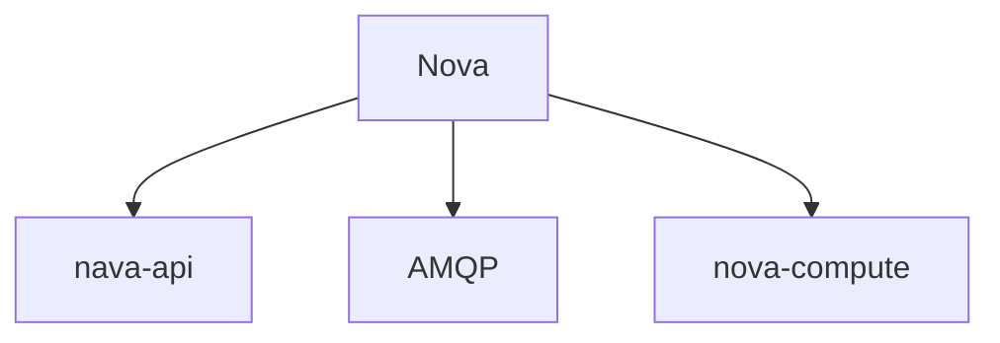
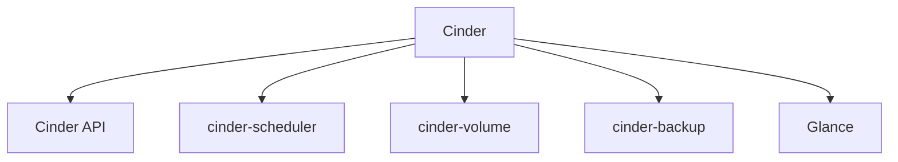

# OpenStack系统架构设计实战

## 概述

OpenStack 是一个开源的云计算管理平台项目，在开源云平台中主题讨论数量最大、社区人数最多、提交代码人数最多的平台。支持几乎所有类型的云环境，项目目标是提供实施简单、可大规模扩展、丰富、标准统一的云计算管理平台。

OpenStack 有几个核心组件组成：

计算（Compute）、对象存储（Object Storage）、镜像服务（Image Service）、网络管理（Network）等；

Github：https://github.com/openstack

OpenStack 的用户界面提供了 Web 界面和 Shell 界面，可以通过界面功能进行创建、维护虚拟机等，操作流程有点像 KVM 管理虚拟机的流程；

## 计算（Compute）Nova

Nova 是一套控制器，用于为单个用户或使用群组启动虚拟机实力。OpenStack中实例的整个生命周期中的所有行为都有 Nova 处理，Nova 管理计算资源的创建、销毁、挂起、迁移等功能。

但是，Nova自身并不提供任何虚拟化能力，而是使用支持虚拟化（Hypervisor）的 API 来提供。

Nova 可以多节点部署，支持主流的 Hypervisor 架构，比如：KVM、LXC、QEMU、Xen、Docker 等；也能和 VMware 对接；

----------------------------

### nova-api

是用 Python 实现的 Web 服务器，实现 RESTful API 到内部请求消息的转换，实际使用 WSGI 来实现；

### 消息队列（AMQP）

是一个提供统一消息服务的应用层标准高级消息队列协议，基于此协议的客户端和消息中间件可以喘息消息；主要有 2 个组件：Exchange 和 Queue；

### nova-compute

负责管理虚拟机，单独运行于承载分配虚拟机的主机智商，通过消息队列获取任务然后执行。走的是 qemu 那套虚拟化方案；

## 存储管理（Cinder）

Cinder 是在虚拟机和具体的存储设备之间引入一个抽象的 “逻辑存储卷”，整合后端存储设备，并通过统一的 API 接口为云平台提供持久性的块设备存储服务。

--------------------------

### Cinder API

接受客户端发来的HTTP请求，然后进行用户身份认证和消息分发，本质上是一个 WSGI 服务；

### cinder-scheduler

Cinder 的调度器，主要功能是通过一定的调度算法选择合适的后端存储节点，用来放置新创建的卷；

### cinder-volume

运行在存储节点，用于管理存储空间，主要执行卷管理相关的功能，比如：创建、删除、挂载、卸载、生成快照等。

### cinder-backup

用于将 cinder 卷备份到其他存储系统上去；

### Glance

提供虚拟机镜像存储和管理服务，比如虚拟机镜像的查询、注册、传输等；

Glance 是存储服务和 OpenStack 其他组件之间沟通的纽带；

## 网络管理（Neutron）

网络管理可太重要了，以前是由各个 nova 自己做的，现在 OpenStack 将这块独立出来，进行统一管理；也是 OpenStack 后续发力的重点；

Neutron 提供了灵活的网络模型、管理IP地址，用户可以创建自己的网络，控制流量，可扩展，实现高级别的多租户、大规模部署网络；

Neutron定位于网络服务，主要实现网络能力的集成、开放和管理，而网络能力的具体实现必须借助于外部的网络功能实体，如SDN控制器，交换机等。

主要功能特点如下：

1）支持创建各种类型网络，如Flat、VLAN、GRE，并可为租户创建自己的业务网络结构，如Web层、应用层、数据层。

2）可为租户插入各种网络服务，如防火墙、负载均衡、IPS、NAT等。

3）主流网络设备厂家都提供了插件以便支持对网络的控制和管理（包括SDN控制器）。

4）支持各种网络虚拟化技术，如VXLAN、NVGRE、VLAN等。

## 计量于监控（Ceilometer）

获取系统中用户对各种资源的使用情况，确保资源处于健康状态；

Ceilometer 获取计量数据的三种方法：通知、轮询、RESTful API；

测量数据通过 Pipeline 发布，Ceilometer 中的 collector 服务用来接受这些测量数据，并持久化到存储介质中；

可以对阈值做告警：边界触发器、组合型；

## 裸机管理（Ironic）

通过 PXE 等裸机管理软件能方便的控制裸机上电，然后通过网络进行操作系统的安装；

提供了一些功能可以进行自动化装机；

## 其他

其他还提供了一些如：大数据服务（Sahara）、数据库服务（Trove）等服务；

