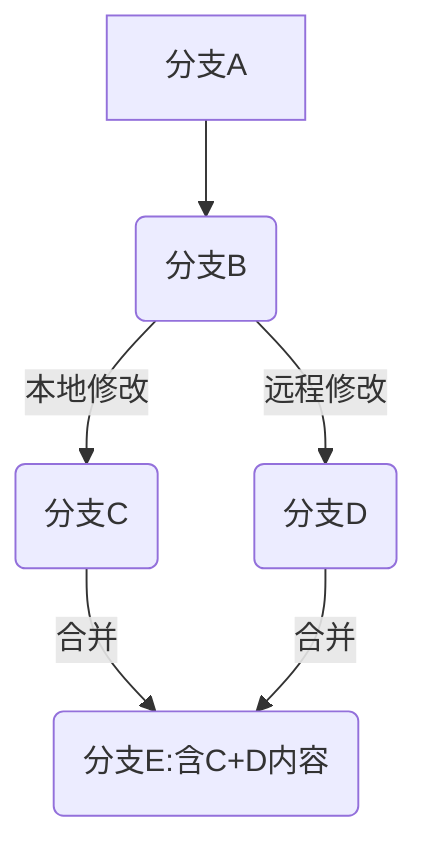
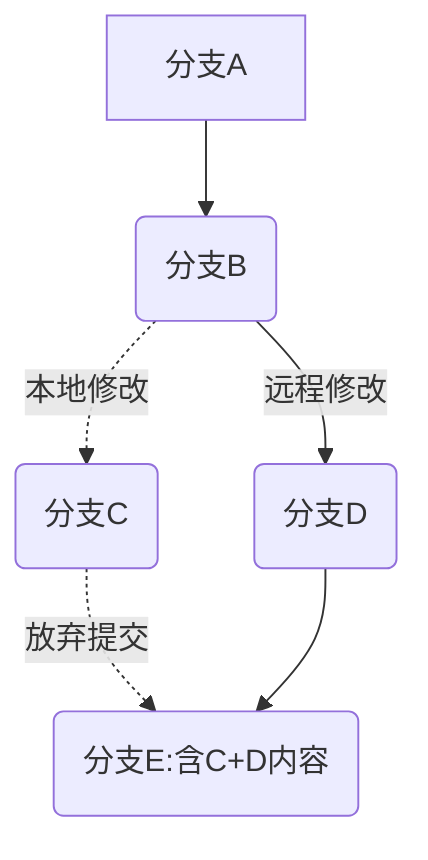

# 代码提交流程与常见场景

## git代码提交流程

* 本地创建密钥对，git项目中部署公钥

```bash
$ ssh-keygen -C "邮箱"
... # 一路Enter
$ cat ~/.ssh/id_rsa.pub
ssh-rsa AAAAB3NzaC1yc2EAAAADAQABAAABAQDfvlLm9Hb4nOJwrW/btXDGNvSWqolr/hxPoAsW3gzxr+fpHFS5/jGAxevjpWqrgd++nQFRVnZnzTDCEdg+kfjTUmx5zqxPFCgMmv3Ci5HuV4MvAjdiReMUNDrLikAZEhuy4H7zW4m+uaOFfrWfwAGnbJNnrverMkjoTL/wkCBvmqimAb8C+67wHV5aHGlrZajiW7zDh8G2sr8NtSifPMz7T/1XV6cYn6w1PIsDzt9Luq4mgmgPqy+U+lgWYRgrUHGt8szYoe1XcJG6NQh3kz3O1RBBcDa2ZR0i5CGVWoZQZQr2J0O22veQAmJmRjGmOcPQJ6QDyT2+Iq+LOohTw8Ov huanghaizhen@uniontech.com
```

* 克隆代码至本地仓库

```bash
$ git clone  ssh克隆地址

# 克隆仓库分为https与ssh，注意这里为ssh地址，否则部署了公钥任然需要输出账号密码
```

* 修改代码后提交（注意：若修改文件为公共文件，则以文件为最小单位提交合并请求，禁止同时修改多个公共文件，避免增加冲突几率）

```bash
$ git add .
$ git commit -m "提交信息"
$ git pull # 注意：拉取仓库最新代码
$ git push
```

## greeit代码提交流程

​		背景：代码管理引入gerrit工具，主要实现提交代码前：自动代码扫描+人工代码审核，提升代码质量，具体提交流程如下：

* 本地创建密钥对，获取公钥
```bash
$ ssh-keygen -C "邮箱"
... # 一路Enter
$ cat ~/.ssh/id_rsa.pub
ssh-rsa AAAAB3NzaC1yc2EAAAADAQABAAABAQDfvlLm9Hb4nOJwrW/btXDGNvSWqolr/hxPoAsW3gzxr+fpHFS5/jGAxevjpWqrgd++nQFRVnZnzTDCEdg+kfjTUmx5zqxPFCgMmv3Ci5HuV4MvAjdiReMUNDrLikAZEhuy4H7zW4m+uaOFfrWfwAGnbJNnrverMkjoTL/wkCBvmqimAb8C+67wHV5aHGlrZajiW7zDh8G2sr8NtSifPMz7T/1XV6cYn6w1PIsDzt9Luq4mgmgPqy+U+lgWYRgrUHGt8szYoe1XcJG6NQh3kz3O1RBBcDa2ZR0i5CGVWoZQZQr2J0O22veQAmJmRjGmOcPQJ6QDyT2+Iq+LOohTw8Ov huanghaizhen@uniontech.com
```
* 访问gerrit进行公钥部署：
  * gerrit地址：[点击跳转](https://gerrit.uniontech.com/settings/)
  * 设置页面滑动至设置项：`SSH keys`
  * `New SSH key`输入框中`公钥`
  * 点击按钮`ADD NEW SSH KEY`
* 安装git-review：`sudo apt install git-review`
* 克隆gerrit自动化测试仓库至本地

```bash
$ git clone -b dev "ssh://ut000827@gerrit.uniontech.com:29418/autotest/cd-uosdevice-os" && scp -p -P 29418 ut000827@gerrit.uniontech.com:hooks/commit-msg "cd-uosdevice-os/.git/hooks/"
```
* 修改代码后提交至gerrit仓库（注意：若修改文件为公共文件，则以文件为最小单位提交合并请求，禁止同时修改多个公共文件，避免增加冲突几率）

```bash
$ git pull origin dev # 注意：拉取仓库最新代码，此步骤不可缺失

# 自动提交
$ cd /cd-uosdevice-os/tools
$ bash gerrit_push.sh               # 自动提交脚本

# 手动提交
$ cd /cd-uosdevice-os
$ cp -rf ./hooks/* ./.git/hooks/    # 添加钩子，进行提交前代码规范、格式检查
$ chmod -R a+x ./.git/hooks/
$ cp -rf gitcommit_template ~/gitcommit_template   # 添加commit模板文件
$ git config --global commit.template ~/gitcommit_template  # 配置commit模板
$ git add .
$ git commit -a
$ git review dev -r origin   # 提交代码至dev

# 若不想每次提交都加上`-r`选项，执行以下命令：
# git config --global gitreview.remote origin 
# 提交代码，直接使用 `git review branch<目标分支>`，例如`git review dev`
```


* 登录gerrit网址，gerrit地址：[点击跳转](https://gerrit.uniontech.com/dashboard/self)

* 选择自己提交的记录，增加`审核+1人员`：点击`ADD REVIEWER`
* 通知审核人员审核修改代码是否符合规范
* 审核人员检查代码，点击`REPLY`填写结果：
  * 通过：+1
  * 不通过：-1（针对错误代码处，可点击进行评论）
* +1审核通过后，通知+2审核人员，进行最终审核并合并代码

**注意：** 提交前请仔细检查


## 分支管理

### 查看分支

​		使用命令：`git branch`

* 查看本地分支

```bash
>git branch
* master
```

* 查看本地+远程分支

```bash
>git branch -a
* master
  remotest/origin/HEAD -> origin/master
  remotest/origin/dev
  remotest/origin/master
  remotest/origin/test
  
# 使用命令git branch -a，远程仓库已经删除的分支在本地依然可以看到
# 使用命令 git remote show origin，可以查看remote地址，远程分支，还有本地分支与之相对应关系等信息

>git remote show origin
* 远程 origin
  获取地址：...
  推送地址：...
  HEAD 分支：master
  远程分支：
    dev                      已跟踪
    master                   已跟踪
    refs/remotes/origin/test 过时（使用 'git remote prune' 来移除）
  为 'git pull' 配置的本地分支：
    dev 与远程 dev 合并
  为 'git push' 配置的本地引用：
    dev 推送至 dev (最新)
```


### 新建分支

​		使用命令：`git branch 分支名称`

* 查看分支

```bash
>git branch
* master
```

* 创建分支

```bash
>git branch hhz
```

* 创建之后再次查看，可看到新建分支，master分支前面有个星号，代表此时还在master分支上

```bash
>git branch
* master
  hhz
```


### 切换分支

​		使用命令：`git checkout 分支名称`

* 创建分支，默认在master上，切换到新的分支hhz上

```bash
>git checkout hhz
A       .idea/vcs.xml
Switched to branch 'hhz'

# 如果当前分支有修改未合并，不允许切换分支，可提交后再切换
```

* 切换成功，查看当前的所有分支

```bash
>git branch
  master
* hhz
```

* 查看当前分支状态也可以用`git status`

```bash
>git status
On branch hhz
```

* 创建分支的同时并切换分支

```bash
>git checkout -b hhz2
A       .idea/vcs.xml
Switched to a new branch 'hhz2'
```

* 等同于：先创建分支，再切换分支

```bash
git branch hhz2
git checkout hhz2
```


### 删除本地分支

​		删掉本地的分支，使用`git branch —delete 分支名称`

* —delete缩写就是-d，可以使用 git branch -d 分支名称来代替
  * 注意：使用—delete删除分支时,该分支必须完全和它的上游分支merge完成,如果没有上游分支,必须要和HEAD完全merge

* -D 是—delete —force的缩写,这样写可以在不检查merge状态的情况下删除分支
  * —force 简写-f,作用是将当前branch重置到初始点(startpoint),如果不使用—force的话,git分支无法修改一个已经存在的分支.

​		在不检查merge状态的情况下删除分支，使用`git branch -D 分支名称` ，它是`git branch --delete --force 分支名称`的缩写

​		**注意：**无法直接删除当前分支，需切换至其他分支

```bash
>git branch
  master
  hhz
* hhz2

>git branch -D hhz2
error: Cannot delete branch 'hhz2' checked out at 'D:/ftp/sat'

>git checkout master
A       .idea/vcs.xml
Switched to branch 'master'
Your branch is up-to-date with 'origin/master'.

>git branch -D hhz2
Deleted branch hhz2 (was c613c75).

>git branch
* master
  hhz
```


### 删除远程分支

​		通过本地的命令行删除远程分支，使用`git push origin -—delete 分支名称`

```bash
>git push origin --delete hhz

 - [deleted]         hhz
 
 # 若未进行关联无法通过本地的命令行删除远程分支，需建立本地分支并关联：git push origin 本地分支:远程分支 ，若本地、远程分支名一致，则可省略`:远程分支`
```


## 文件管理

### 恢复代码

#### 放弃修改

`git reset --hard {commint id}`

代码整体回退到该次提交，所有修改均放弃。

#### 保留修改

`git reset --soft {commint id}`

代码当前指针移到该次提交，所有修改均保留。

备注：常用于代码提交后被驳回，此时可移动指针后再次提交代码即可。


### 恢复文件

#### 恢复最新版本

* 本地修改未提交

```bash
$ git checkout -- other.sh  # other.sht为文件名
```

* 本地修改，已提交至暂存区（即编辑之后，git add但没有 git commit -m ....）

```bash
$ git reset HEAD    # 回退到当前版本
$ git checkout -- other.sh  # other.sht为文件名
```

* 本地修改，已提交至仓库区（即编辑之后，git add和 git commit -m ....）

```bash
$ git reset HEAD^    # 回退到上一个版本
$ git checkout -- other.sh  # other.sht为文件名
```


#### 恢复至任意版本

```bash
 $ git log --oneline
fbcfafd (HEAD -> dev) ly-5  # HEAD
02d906a ly-4  # HEAD^
08493f3 Merge branch 'dev' of https://e.coding.net/mars-z/sat/SAT into dev   # HEAD^^
c11ed08 ly-3  # HEAD~4
dc07dfe ly-2

# 第一列为版本号
git reset 版本号
git checkout -- other.sh  # other.sht为文件名

```


## 拉取代码差异
​		使用git pull 与 git pull --rebase的差异，建议使用`git pull --rebase`，使提交曲线为直线，让大家易于理解。
* git pull = git fetch + `git merge`



* git pull --rebase = git fetch + `git rebase`




## 文件冲突

* git pull --rebase:

```bash
在rebase的过程中，有时也会有conflict，这时Git会停止rebase并让用户去解决冲突，解决完冲突后
1、用git add命令去更新这些内容
2、然后不用执行git-commit,直接执行git rebase --continue,这样git会继续apply余下的补丁。

注意：在任何时候，都可以用git rebase --abort参数来终止rebase的行动，并且mywork分支会回到rebase开始前的状态。
```


### 异常问题收集

#### git config报错

操作人：黄海针

操作背景：执行命令`$ git config --global user.email "huanghaizhen@uniontech.com"`失败

报错：`error: 不能锁定配置文件 /home/mars/.gitconfig: 权限不够`

根因：执行以上命令时，会在家目录创建文件`.gitconfig`，显然该提示是因为权限不够，查看家目录权限为555（why？）

解决方案：修改家目录权限为755解决问题，需要注意的时，在以上命令前加`sudo`任然无法创建文件`.gitconfig`

参考资料：暂无


