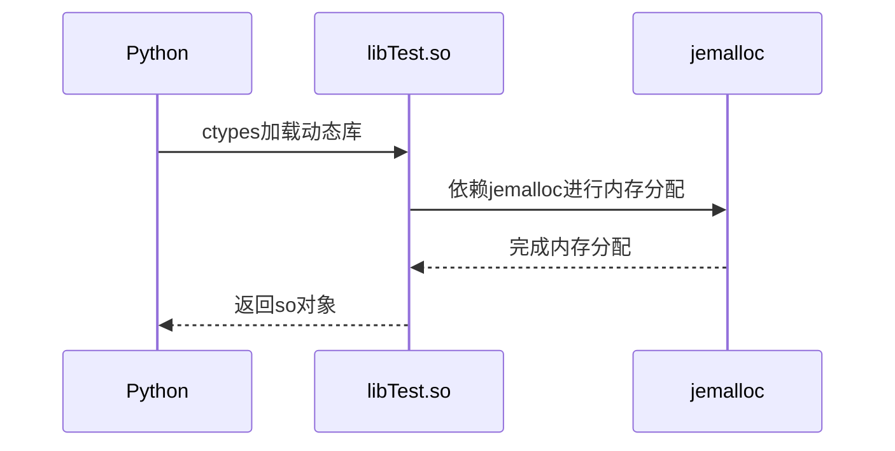
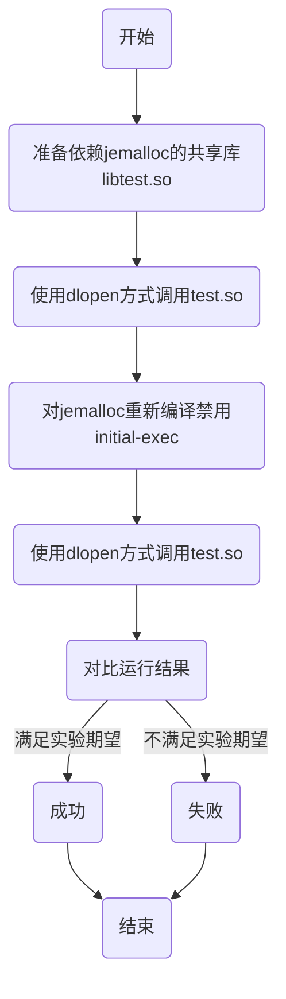

# `Python`调用动态库运行时报静态`TLS`块不能分配内存根因分析报告

## 一、相关术语

|   缩写   |         全称         | 描述                                                       |
| :--: | :--: | :--- |
|  Python  |        Python        | 一种跨平台的计算机程序设计语言                             |
|   C++    |         C++          | 一种静态数据类型检查的、支持多重编程范式的通用程序设计语言 |
|  `jemalloc`  |        `jemalloc`        | 一种内存分配器                          |
| `TLS` |       Thread-Local Storage       | 一种实现线程私有全局变量的机制                              |
| Initial Executable | Initial Executable | 一种在程序启动后从加载的共享对象中引用`TLS`变量的模型 |

## 二、问题概述
【背景】

基于Python、C++，通过白盒测试手段完成对某些重要功能在代码层面的测试

【复现步骤】

1.`Python`通过`ctypes`第三方库调用C++ 动态库so文件中的函数

```python
import ctypes
from utils import config

#加载C++动态库
lib = ctypes.cdll.LoadLibrary(config.so_path+'/libfjemalloc.so')
print(lib.fibo(8))
```

2.运行时报`libjemalloc.so.2 cannot allocate memory in static TLS block`

【期望】

可正常调用共享库so中的函数并得到正确的结果。

【环境】

硬件环境：`X86`平台、`ARM`平台（`龙芯平台、申威平台未依赖jemalloc`）

python：`3.7`

jemalloc:`5.1.0-3`


## 三、问题分析

在`X86`平台和ARM平台上，Python调用C++动态库so中函数并运行的流程如下图所示，Python程序使用第三方库`ctypes`加载`libTestlib`、并通过`jemalloc`进行内存分配。



。

**【分析】**

加载动态库`jemalloc`时报不能在静态`TLS`块中分配内存，可以猜测导致出现报错的原因有两种：

- 第一：Python使用第三方库`ctypes`调用C++动态库存在问题。
- 第二：`jemalloc`内部在分配内存时有一些特性导致加载C++动态库存在问题。

**对第一种情况进行分析**

使用`ctypes.cdll.LoadLibrary`的方式加载依赖`jemalloc`的动态库与加载不依赖`jemalloc`的动态库，验证Python是否能正常加载so文件：

1.通过`ctypes`加载不依赖`jemalloc`的共享库：`ldd libfibo.so`列出该库依赖的其他共享库


```python
import ctypes
from utils import config

#加载C++动态库
lib = ctypes.cdll.LoadLibrary(config.so_path+'/libfibo.so')
print(lib.fibo(8))

运行结果：
/usr/bin/python3.7 /home/mola/PycharmProjects/whitebox-autotest/test.py
1
```

2.通过`ctypes`加载依赖`jemalloc`的共享库：`ldd libfjemalloc.so`列出该库依赖的其他共享库


```python
import ctypes
from utils import config

#加载C++动态库
lib = ctypes.cdll.LoadLibrary(config.so_path+'/libfjemalloc.so')
print(lib.fibo(8))

运行结果：
Traceback (most recent call last):
  File "/home/mola/PycharmProjects/whitebox-autotest/utils/test1.py", line 11, in <module>
    lib = ctypes.cdll.LoadLibrary(config.so_path+'/libfjemalloc.so')
  File "/usr/lib/python3.7/ctypes/__init__.py", line 434, in LoadLibrary
    return self._dlltype(name)
  File "/usr/lib/python3.7/ctypes/__init__.py", line 356, in __init__
    self._handle = _dlopen(self._name, mode)
OSError: /lib/x86_64-linux-gnu/libjemalloc.so.2: cannot allocate memory in static TLS block

```

根据调用两个共享库的对比结果可知，Python通过`ctypes`第三方库加载C++共享库的方案是可行的。

**对第二种情况进行分析**

`jemalloc`是一个能够快速分配/回收内存，减少内存碎片，对多核友好，具有可伸缩性的内存分配器。

`TLS`线程局部缓存，将数据和执行的特定的线程连续起来，在线程内部，各个函数可以像使用全局变量一样调用它，但它对线程外部的的其他线程是不可见的。

`TLS`有４种访问模型，每个`TLS`的引用均遵循其中之一，另外，可以从较一般的访问模型转换为更优化的访问模型。

| 访问类型                                                     | 解释                                                         |
| ------------------------------------------------------------ | ------------------------------------------------------------ |
| General Dynamic (GD) - dynamic `TLS`                         | 此模型允许从共享对象或动态可执行文件引用所有`TLS`变量，当`TLS`块首次从特定线程引用时，该模型还支持延迟分配`TLS`块 |
| Local Dynamic (`LD`) - dynamic `TLS` of local symbols        | 该模型是对GD模型的优化。编译器可以确定变量是在本地绑定的，还是在正在构建的对象中受保护的 |
| Initial Executable (IE) - static `TLS` with assigned offsets | 这个模型只能引用作为初始静态`TLS`模板一部分的`TLS`变量。这个模板由进程启动时可用的所有`TLS`块以及一个小的备份预留块组成。（通过固定预留块来满足有限数量`TLS`的访问） |
| Local Executable (LE) - static `TLS`                         | 这个模型只能引用作为动态可执行文件的`TLS`块的一部分的`TLS`变量 |

查看`jemalloc`源码可知，`jemalloc`默认打开initial-exec模型并定义了`JEMALLOC_TLS_MODEL`

```c++
dnl Use initial-exec TLS by default.
AC_ARG_ENABLE([initial-exec-tls],
  [AS_HELP_STRING([--disable-initial-exec-tls],
                  [Disable the initial-exec tls model])],
[if test "x$enable_initial_exec_tls" = "xno" ; then
  enable_initial_exec_tls="0"
else
  enable_initial_exec_tls="1"
fi
],
[enable_initial_exec_tls="1"]
)
AC_SUBST([enable_initial_exec_tls])

if test "x${je_cv_tls_model}" = "xyes" -a \
       "x${enable_initial_exec_tls}" = "x1" ; then
  AC_DEFINE([JEMALLOC_TLS_MODEL],
            [__attribute__((tls_model("initial-exec")))])
else
  AC_DEFINE([JEMALLOC_TLS_MODEL], [ ])
fi

```

通过`JEMALLOC_TLS_MODEL`，找到了`tsd.h`，里面的头文件清晰的解释了定义与不定义`JEMALLOC_TLS_MODEL`的区别,如果默认开启了initial-exec模型，即定义了`JEMALLOC_TLS_MODEL`，则使用`tsd_tls.h`，如果没有，则使用`tsd_generic.h`

```c++
//tsd.h
#ifdef JEMALLOC_MALLOC_THREAD_CLEANUP
#include "jemalloc/internal/tsd_malloc_thread_cleanup.h"
#elif (defined(JEMALLOC_TLS))
#include "jemalloc/internal/tsd_tls.h"
#elif (defined(_WIN32))
#include "jemalloc/internal/tsd_win.h"
#else
#include "jemalloc/internal/tsd_generic.h"
#endif
```

查阅`tsd_tls.h`源码：直接将变量赋值给了已经存在的内存地址

```c++
//tsd_tls.h
/* Get/set. */
JEMALLOC_ALWAYS_INLINE tsd_t *
tsd_get(bool init) {
	return &tsd_tls;
}

JEMALLOC_ALWAYS_INLINE void
tsd_set(tsd_t *val) {
	assert(tsd_booted);
	if (likely(&tsd_tls != val)) {
		tsd_tls = (*val);
	}
	if (pthread_setspecific(tsd_tsd, (void *)(&tsd_tls)) != 0) {
		malloc_write("<jemalloc>: Error setting tsd.\n");
		if (opt_abort) {
			abort();
		}
	}
}

```

查阅`tsd_generic.h`：先申请内存空间，再将变量赋值给申请的内存地址

```c++
//tsd_generic.h
/* Get/set. */
JEMALLOC_ALWAYS_INLINE tsd_t *
tsd_get(bool init) {
	tsd_wrapper_t *wrapper;

	assert(tsd_booted);
	wrapper = tsd_wrapper_get(init);
	if (tsd_get_allocates() && !init && wrapper == NULL) {
		return NULL;
	}
	return &wrapper->val;
}

JEMALLOC_ALWAYS_INLINE void
tsd_set(tsd_t *val) {
	tsd_wrapper_t *wrapper;
	assert(tsd_booted);
	wrapper = tsd_wrapper_get(true);
	if (likely(&wrapper->val != val)) {
		wrapper->val = *(val);
	}
	wrapper->initialized = true;

}
```

综上分析，`jemalloc`默认开启initial-exec模型，直接将静态`TLS`变量指向已有的内存空间，但Python是使用`dlopen`的方式加载动态库，即没有分配好的内存空间，因此相关报错大概率与`jemalloc`的initial-exec模型特性有关。

## 四、实验验证

根据分析结果，相关报错大概率与`jemalloc`的initial-exec模型特性有关。那么可以通过在编译`jemalloc`时启用和禁用该功能来判断该分析结论是否正确。



【影响分析】

根据问题分析中的源码分析可知，禁用与不禁用initial-exec的不同在于变量的内存空间分配上，不会对原有代码的功能逻辑产生影响。

【实验环境】

系统：`uos 20 1030`

python：`3.7`

jemalloc:`5.1.0-3`

【实验设计】

实验操作：

操作1：编译一个依赖`jemalloc`的动态库`libtest.so`。

操作2：对`jemalloc`进行重新编译禁用initial-exec。

操作3：进行操作2前，使用`dlopen`加载`libtest.so`，记录运行结果。

操作4：进行操作2后，使用`dlopen`加载`libtest.so`，记录运行结果。

实验步骤：

操作1->操作3->操作2->操作4

实验期望：
$$
对jemalloc重新编译后，可通过dlopen方式正常加载test.so
$$


【实验验证】

步骤一：首先完成操作1，编译一个依赖`jemalloc`的动态库`libtest.so`。

```c
#include <iostream>

using namespace std;

extern "C" {
    unsigned long fibo(int n);
}
unsigned long fibo(int n)
{
    long result = 0;
    if (n <= 0 || n > 100) { 
        result = 0;
    }
    else { 
        result=n;
    }
    return result;
}
```

使用如下命令进行编译

`g++ -fPIC -shared test.cpp -o libtest.so -ljemalloc`

步骤二:使用Python直接调用`libtest.so`，运行结果如下：

```python
#python源码
import ctypes
from utils import config
#加载C++动态库
lib = ctypes.cdll.LoadLibrary(config.so_path+'/libtest.so')
print(lib.fibo(8))

#运行结果
/usr/bin/python3.7 /home/mola/PycharmProjects/whitebox-autotest/utils/test1.py
Traceback (most recent call last):
  File "/home/mola/PycharmProjects/whitebox-autotest/utils/test1.py", line 11, in <module>
    lib = ctypes.cdll.LoadLibrary(config.so_path+'/test.so')
  File "/usr/lib/python3.7/ctypes/__init__.py", line 434, in LoadLibrary
    return self._dlltype(name)
  File "/usr/lib/python3.7/ctypes/__init__.py", line 356, in __init__
    self._handle = _dlopen(self._name, mode)
OSError: /lib/x86_64-linux-gnu/libjemalloc.so.2: cannot allocate memory in static TLS block

Process finished with exit code 1
```

步骤三：重新编译`jemalloc`，禁用initial-exec

```shell
1.下载jemalloc-5.1.0.tar.bz2
2. tar -xjvf jemalloc-5.1.0.tar.bz2
3. ./configure -prefix=/usr/local/jemalloc  --disable-initial-exec-tls
4. make && make install
5. cp /usr/local/jemalloc/lib/libjemalloc.so.2 /lib/x86_64-linux-gnu/
```

步骤四：使用Python直接调用`libtest.so`，运行结果如下：

```python
#python源码
import ctypes
from utils import config
#加载C++动态库
lib = ctypes.cdll.LoadLibrary(config.so_path+'/libtest.so')
print(lib.fibo(8))

#运行结果
/usr/bin/python3.7 /home/mola/PycharmProjects/whitebox-autotest/utils/test1.py
8

Process finished with exit code 0
```

步骤五：运行结果对比

根据实验结果，未禁用initial-exec时运行程序会报错、禁用initial-exec后程序可正常运行，即禁用前，需要提前预留内存并将其分配给相应的静态`TLS`使用，禁用后，则不再需要提前分配内存，因此**数据符合期望值**。

**最终得出结论：**

Python调用动态库报错的根本原因是:`jemalloc`默认打开了`Initial Executable (IE)` 模型，而Python是通过`dlopen`的方式加载动态库，导致没有预留的内存可分配给相应的静态`TLS`使用。

## 五、解决方案

根据上述实验可知，在程序启动后，加载包含静态`TLS`的共享对象时，会给这些静态`TLS`分配内存，由于Python的第三方库`ctypes`是使用`dlopen`的方式加载动态库（`以dlopen的方式加载动态库只能在程序运行时进行内存分配，不能提前分配内存`）导致报不能在静态`TLS`中分配内存的错误。

**方案一：更换动态库的依赖对象**

既然调用依赖`jemalloc`的动态库，会报不能在静态`TLS`中分配内存的错误，那么可以换一种内存分配器来规避该问题，常见的内存分配器有`tcmalloc`、`jemalloc`、`ptmalloc`，如果我们的动态库在编译时没有指定`jemalloc`，则默认链接到`ptmalloc`，即经过上面的问题分析可知，使用`ptmalloc`内存分配器不会出现相关报错。

**方案二：禁用`jemalloc`的Initial Executable模型特性**

使用`jemalloc`会报相关错误的原因是`jemalloc5`新增了一个新特性，会在加载包含静态`TLS`的动态库时给静态`TLS`分配内存，但由于使用`dlopen`的方式加载动态库，没有静态存储区可用，因此我们可以通过禁用`jemalloc`的这个特性来解决这个问题，可使用shell脚本来实现该操作的自动化。

```shell
#!/bin/bash
echo "1"|sudo -S su
apt source libjemalloc-dev
cd jemalloc-5.1.0
./configure -prefix=/usr/local/jemalloc  --disable-initial-exec-tls
make && make install
cp /usr/local/jemalloc/lib/libjemalloc.so.2 /lib/x86_64-linux-gnu/
```

**方案比较**

从可行性、可操作性、稳定性等方面进行考虑可知，由于我们是通过Python加载动态库的方式对开发的C++源码进行测试，而开发构建出来的动态库在`X86`平台和ARM平台默认依赖`jemalloc`（`龙芯和申威未依赖jemalloc`），如果要更换内存分配器，则潜在影响是未知且巨大的，方案一从可操作性、稳定性方面被否决；方案二目前能解决该问题，且可操作性很强，影响也较小。

|          | 方案一 | 方案二 |
| -------- | ------ | ------ |
| 可行性   | 可行   | 可行   |
| 易操作性 | 较差   | 较好   |
| 跨平台性 | 不可行 | 可行   |
| 稳定性   | 不稳定 | 稳定   |

**影响评估:**

`jemalloc`默认开启Initial Executable模型特性的优点：在对静态`TLS`进行内存分配时可直接赋值，不需要每次都重新申请内存空间，可使性能有一定的提升。

`jemalloc`禁用Initial Executable模型特性的影响：首先，在性能方面会有一定的影响，其次，在动态申请内存时会存在一定的风险，例如可能会遇到没有内存可用的极端情况等。本次使用场景为基于`Python`、对Ｃ++动态库的白盒测试，因此在性能及其他方面的影响可忽略。

**最终结论：**

最终选择方案二来解决该问题，即禁用`jemalloc`的Initial Executable模型特性。

## 六、小结

问题描述：Python通过`ctypes`第三方库调用C++ 动态库so文件中的函数，运行时报`libjemalloc.so.2 cannot allocate memory in static TLS block`。

根因查找步骤：现象->分析->假设->实验->验证->结论。

根本原因：`jemalloc5`有一个新特性，在加载共享对象时会给静态`TLS`分配预留内存。由于Python使用`dlopen`的方式加载共享对象，不能提前预分配内存导致报错。

解决方案：重新编译`jemalloc`禁用Initial Executable模型特性。

优化/改进：可向在`jemalloc`源码中自动判定是否需要开启`TLS`的Initial Executable特性的方向探索

收获与启示：在平时工作过程中，需要多多学习系统底层相关理论知识，在原理上实践。

## 七、参考资料

* [jemalloc源码](https://github.com/jemalloc/jemalloc/)

* [TLS四种模式介绍](https://blog.csdn.net/foreverfresh/article/details/78932776)

