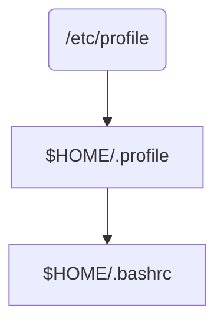

# rootfs进入MATE桌面后打开终端不能执行reboot指令根因分析

## 一、相关术语

<center style="color:#C0C0C0;text-decoration">表1 相关术语</center>

| 全称            | 缩写   | 描述                                                         |
| --------------- | ------ | ------------------------------------------------------------ |
| Root FileSystem | rootfs | 根文件系统，针对特定的操作系统的架构，一种实现的形式;具体表现为，特定的目录（就理解为Windows的文件夹），目录之间的关系，即组织架构，以及特定的各种文件 |
| MATE            | MATE   | MATE 是一个Linux桌面环境，它是基于已经停止维护的GNOME2代码库开发而成。 |
| X Server        | /      | X Server是Linux系统里面图形接口服务器的简称。Windows系统的界面是这个系统不可分割的一部分，各种窗口操作界面显示都是由系统核心直接管理的，而Linux的图形界面并不是系统的必要组成部分，它可以在无界面的条件下运行。当需要Linux提供界面的时候，系统就会建立一个或者数个X Server，通过X协议跟窗口管理器交互，由独立于系统的应用程序来产生窗口，状态栏，按钮之类的交互界面。 |
| X Session       | /      | X Session是指X Server启动后直到X Server关闭之间的这段时间。这期间一切跟X相关的动作都属于X Session的内容 |


## 二、问题概述

1、问题引入

专用设备系统多个架构中，对arm架构系统开发板构建了一个适用RK3399开发板的rootfs GUI版本系统。在rootfs GUI版本系统启动后登录桌面时，普通用户终端中不能执行reboot指令（[Bug链接](https://pms.uniontech.com/zentao/bug-view-64719.html)）。

2、硬件环境

- 设备型号：RK3399

- 处理器：Dual-core Cortex-A72 up to 1.8GHz & Quad-core Cortex-A53 up to 1.5GHz 六核处理器
- 内存：4GB LPDDR4
- 存储：板载 SPI Flash（16MB ）高速 eMMC 32GB
- 显卡：Mali-T860 MP4 四核 GPU

3、软件环境

- 操作系统：uniontechos-device-20-gui-1000_ARM64-RK3399-20210225-1400.img
- 桌面版本：1.20.4-2 
- terminal版本：lxterminal（ 0.3.2-1）& mate-terminal （1.20.2-2）

4、复现步骤

（1）使用开发板烧录工具（upgrade_tool），烧录镜像uniontechos-device-20-gui-1000_ARM64-RK3399-20210225-1400.img；

（2）烧录完成后，系统上电自动开机；

（3）系统开机后，输入密码登录系统；

（4）终端中执行reboot重启系统。

5、问题现象

​		rootfs进入MATE桌面后打开终端普通用户终端中不能执行reboot指令。如图1 ：


<center style="color:#C0C0C0;text-decoration">图1 问题现象</center>

6、期望

​		作为桌面版系统，重启系统是常用且不可缺少的指令命令，当不可使用时，会对普通用户造成极其不好的影响，期望可以正常运行重启命令。并且对比ARM裁剪系统GUI版本，普通用户可以执行reboot命令，RK3399 开发版GUI版本需要和ARM裁剪系统GUI版本表现保持一致。


## 三、问题分析

​		启动RK3399系统后，从greeter登录“uos”用户，打开终端执行reboot，提示`bash: reboot: 未找到命令`。首先猜测是系统缺失reboot程序，但是切换root用户后，重启、关机等命令又可以正常运行。继续尝试shutdown now、ip addr等常用命令，依旧提示未找到命令。

​		当在shell命令行界面执行一个命令时，shell必须搜索系统目录来找到对应的程序。PATH环境变量定义了用于进行命令和程序查找的目录。而reboot等命令位于系统/usr/sbin目录下，通过find查找，可以找到reboot文件的存放位置，但是通过`which reboot`进行查找，却返回为空，也就是在当前用户环境变量中并不存在reboot文件的路径。在当前“uos”用户终端中打印系统环境变量PATH，如下：

```bash
# shell终端信息
uos@uos:~$ find /usr -name reboot
/sbin/reboot
……
uos@uos:~$ which reboot

uos@uos:~$ echo $PATH
/usr/local/bin:/usr/bin:/bin:/usr/local/games:/usr/games		
```

确定了当前系统环境变量中缺少`/usr/sbin/`（超级用户指令都位于/usr/sbin）。

​		尝试通过tty登录系统，执行reboot，系统正常响应了重启。在tty下查看PATH环境变量，变量中存在超级用户指令所在路径的变量信息`/sbin:/usr/sbin/`，表示仅通过桌面登录的方式会触发此问题现象。并且由于从桌面启用shell终端，切换到root用户可以正常执行reboot等命令，普通用户无法执行，所以猜测环境变量加载后，被某种文件加载时进行了重写。

​		查阅资料，了解到linux系统环境变量区分三类变量配置。见表2：

<center style="color:#C0C0C0;text-decoration">表2 环境变量说明</center>

|   类型   | 配置文件     | 作用域                                                       |
| :------: | ------------ | :----------------------------------------------------------- |
| 局部变量 | ~/.bashrc    | 包含专用于当前bash shell的bash信息，当登录时以及每次打开新的shell时，该文件被读取 |
| 用户变量 | ~/.profile   | 每个用户都可使用该文件输入专用于自己使用的shell信息，当用户登录时，该文件仅仅执行一次!默认情况下，他设置一些环境变量，执行用户的.bashrc文件 |
| 全局变量 | /etc/profile | 为系统的每个用户设置环境信息，当用户第一次登录时，该文件被执行。并从/etc/profile.d目录的配置文件中搜集shell的设置 |


​		登录Linux时，首先启动 `/etc/profile`文件，然后再启动用户家目录下的`~/.profile`文件和`~/.bashrc`文件，执行顺序为：



<center style="color:#C0C0C0;text-decoration">图2 环境变量加载流程</center>

​		了解环境变量配置文件加载顺序后，按照加载顺序检查环境变量配置对于PATH的定义是否有缺失，查看`/etc/profile`对全局环境变量的配置代码如下：

```bash
# /etc/profile对于PATH变量的赋值
if [ "`id -u`" -eq 0 ]; then
  PATH="/usr/local/sbin:/usr/local/bin:/usr/sbin:/usr/bin:/sbin:/bin"
else
  PATH="/usr/local/bin:/usr/bin:/bin:/usr/local/games:/usr/games:/sbin:/usr/sbin"
fi

export PATH

```

​		从对系统全局环境变量的配置查证，不管是普通用户还是root用户，在PATH中都有加入`/sbin:/usr/sbin`，并将PATH进行了export导出。所以tty下查看环境变量无缺失，reboot指令也可以响应运行。继续查看配置文件`~/.profile`和`~/.bashrc`对于PATH变量是否有进行覆盖或者重写：

```bash
# .profile对于PATH变量的赋值
# if running bash
if [ -n "$BASH_VERSION" ]; then
    # include .bashrc if it exists
    if [ -f "$HOME/.bashrc" ]; then
        . "$HOME/.bashrc"
    fi
fi

# set PATH so it includes user's private bin if it exists
if [ -d "$HOME/bin" ] ; then
    PATH="$HOME/bin:$PATH"
fi

# set PATH so it includes user's private bin if it exists
if [ -d "$HOME/.local/bin" ] ; then
    PATH="$HOME/.local/bin:$PATH"
fi

# .bashrc 没有对于PATH变量的赋值，不做展示

```

​		查看配置文件脚本后，发现`~/.bashrc`没有对PATH进行任何操作，`~/.profile`中虽然有对PATH重新赋值，但是也仅仅在已有$PATH的基础上自增部分环境变量（`/$HOME/bin`目录和`$HOME/.local/bin`），并没有对全局变量配置文件`/etc/profile`中定义的PATH变量进行替换、覆盖。便猜测是系统在登录桌面环境后，没有执行调用全局变量配置文件`/etc/profile`导致环境变量异常。

​		随即在/etc/profile、~/.profile、~/.bashrc加入调试信息进行验证：

```bash
    # 在/etc/profile中脚本第一行加入调试信息
    echo `date +"%Y-%m-%d %H:%M:%S"` load profile!
    # 在uos用户家目录，.profile脚本第一行加入调试信息
    echo `date +"%Y-%m-%d %H:%M:%S"` load uos profile!
	# 在uos用户家目录，.bashrc脚本第一行加入调试信息
    echo `date +"%Y-%m-%d %H:%M:%S"` load uos bashrc!
```

​		添加调试信息后，重启系统，并从greeter登录“uos”进入系统，登录系统后启动lxterminal和mate-terminal 终端，终端均没有打印`/etc/profile`和 用户家目录下的 `.profile`中脚本第一行加入的调试信息。只打印了用户家目录下的`.bashrc`中添加的调试信息。但是通过在终端中登录 用户的方式，系统会按照配置文件的加载顺序进行加载，按照顺序打印出3行调试信息。如图3：


<center style="color:#C0C0C0;text-decoration">图3 调试详情</center>

​		阅读bash man手册以及shell相关资料，得知直接启动终端执行命令的方式为非登录式（no-login shell）、交互式（interactive shell）行为。如表3 shell启动方式介绍，该行为下不会去运行任何profile和rc文件，只有登录式（login shell）会在登录时自动执行`/etc/profile`和`~/.profile`文件。从此处分析，无法使用reboot等命令属于正常情况。

<center style="color:#C0C0C0;text-decoration">表3 shell启动方式</center>

| 启动方式                          | 说明                                                         |
| --------------------------------- | ------------------------------------------------------------ |
| 登录式（login shell）             | 需要用户名、密码登录后才能进入的shell（或者通过"--login"选项生成的shell）。它会首先读取和执行/etc/profile全局配置文件中的命令，然后依次查找~/.bash_profile、~/.bash_login 和 ~/.profile这三个配置文件，读取和执行 |
| 非登录式（non-login shell）       | 不需要输入用户名和密码即可打开的Shell，例如：直接命令“bash”就是打开一个新的非登录shell，在Gnome或KDE中打开一个“终端”（terminal）窗口程序也是一个非登录shell。在非登录shell里，只读取 ~/.bashrc （和 /etc/bash.bashrc、/etc/bashrc ）文件 |
| 交互式（interactive shell）       | 在终端上执行，shell等待用户的输入，并且立即执行用户提交的命令 |
| 非交互式（non-interactive shell） | 以shell script方式执行，在这种模式下，shell不与用户进行交互，而是读取存放在文件中的命令，并且执行 |

​		

​		但是对比ARM裁剪系统GUI版本，同样的使用场景，却可以正常使用reboot等命令。按照rootfs添加调试信息的方式，在裁剪系统GUI版本`/etc/profile`、`~/.profile`、`~/.bashrc`加入调试信息进行验证。发现在启动后登陆桌面后，打开终端会打印加载这三个配置文件的调试信息。由于rootfs GUI版本采用的MATE桌面，而ARM裁剪系统GUI版本采用的DDE桌面环境，不同的桌面环境在启动时，对于环境变量的加载也可能出现差异。所以判断裁剪系统GUI版本对此问题进行了单独的处理。

​		因此确认 rootfs GUI版本桌面终端打开后不能直接使用reboot，根本原因是因为在启动非登录式shell时，系统没有加载`/etc/profile`配置文件，引起环境变量PATH中缺少`/sbin:/usr/sbin`导致。


## 四、实验验证

### 4.1 程序设想

​		经过以上分析，得出结论：RK3399开发版-GUI 系统启动从greeter登录后，打开终端无法直接执行重启等操作，是由于系统没有加载`/etc/profile`全局变量配置文件，导致PATH变量中缺少`/sbin:/usr/sbin`，从而导致reboot不能使用。只要在打开终端时，需要将PATH环境中追加`/sbin:/usr/sbin`。


### 4.2 实验验证（1）

​		由于进入系统桌面后PATH环境变量都缺少`/sbin:/usr/sbin`才导致不能使用该目录下的应用程序。在每次打开终端窗口时，将环境变量进行补全，理论上可以解决问题现象。启动系统进入桌面，打开终端窗口后补全PATH环境变量，如图4：

代码：

```bash
# 终端窗口中执行
PATH=$PATH:/sbin:/usr/sbin
```


<center style="color:#C0C0C0;text-decoration">图4 手动补全环境变量</center>

追加环境变量后，执行reboot命令，系统响应重启。


### 4.3 实验验证（2）

​		虽然不会自动加载全局变量，但是每次打开终端，属于交互式（interactive shell）行为，在该行为模式下，会自动加载 bash 配置文件，意味着可以在加载 bash 配置文件时或者加载之前， 将`$PATH`环境中追加`/sbin:/usr/sbin`便能解决。

​		`/etc/bash.bashrc` 配置文件是为每一个运行bash shell的用户执行此文件，里面包括如自动补全等功能配置。当bash shell被打开时，该配置文件被调用执行，阅读其代码内容，并无对PATH进行赋值定义，随即在脚本末尾增加以下内容：

```bash
# 对$PATH进行追加/sbin:/usr/sbin，并导出
PATH=$PATH:/sbin:/usr/sbin
export PATH
```

​		添加保存后，重启系统，登录桌面后打开终端，终端打印PATH变量正常，如图5所示，执行reboot系统正常重启。


<center style="color:#C0C0C0;text-decoration">图5 自动加载环境变量-1</center>

​		继续边缘验证，该方式虽然可以解决此问题，但是存在不足，当在同一个终端中再次登录一个用户或者以登录方式打开shell，由于系统会自动先加载/etc/profile，然后再加载/etc/bash.bashrc ，所以导致变量值重复。如图6：


<center style="color:#C0C0C0;text-decoration">图6 自动加载环境变量-2</center>

​	

## 五、解决方案

​		在上述实验验证和问题分析中已经找到了问题根源，针对问题设计了两个解决方案。


#### 5.1 解决方案一

##### 5.1.1在bash环境变量中追加PATH并导出		

​		该方案保证每次启动的bash中都不会缺失`/sbin:/usr/sbin`，从而解决问题。由于直接在bash全局变量配置文件`/etc/bash.bashrc`中对$PATH进行追加`/sbin:/usr/sbin`，会导致每次启动一个bash时，变量持续自增，所以对解决代码进行修改，设计如下：

```bash
# 在/etc/bash.bashrc增加环境变量内容
# 追加之前先判断是否已存在/sbin:/usr/sbin，不存在时，对$PATH进行追加/sbin:/usr/sbin，并导出
check_path=$(echo $PATH|grep sbin)
if [ -z $check_path ]; then
	PATH=$PATH:/sbin:/usr/sbin
	export PATH
fi
```


##### 5.1.2实际验证

​		将此解决方案提供至系统开发人员，合入构建镜像中。构建系统完成后，烧录系统至RK3399开发板。重新启动系统。从用户界面登录系统。打开终端窗口，查询PATH环境变量，变量内容完整，无缺失，多次在终端中执行`bash`命令，PATH变量没有持续自增。执行reboot命令，系统成功重启。重新开机后分别在tty、远程ssh连接、终端登录root账户，执行`reboot`、`shutdown now`，系统均响应正常。


#### 5.2 解决方案二

##### 5.2.1在启动X Server时自动导入profile	

​		在裁剪系统GUI版本/etc 目录下寻找调用/etc/profile的配置代码，最终在/etc目录下发现在`/etc /X11/Xsession.d/`目录下存在一个关于profile的可执行脚本"01deepin-profile "。查阅X11/Xsession.d/相关资料得知，系统启动时会自动启动X Server，X Server启动时，会进入/etc /X11/Xsession.d/目录轮询地执行所有脚本。所以，在裁剪系统GUI版本上，当执行了"01deepin-profile "后，便把/etc/profile下的PATH进行导出。等到用户登录系统后，从桌面启动终端，终端环境会继承X Server服务载入的环境变量。这样设计的好处在于，用户启动系统登录后，系统全局环境变量已经准备完毕，用户直接能使用完整的系统环境变量。

​		而RK3399 rootfs-GUI镜像中不存在此配置文件，启动系统后，X Server没有可以载入profile的可执行脚本，导致用户从桌面打开终端后，无法使用reboot命令。所以rootfs增加此可执行脚本，即可解决该问题。

​		在`/etc /X11/Xsession.d/`新增可执行脚本“profile”，代码如下：

```bash
[ -f /etc/profile ] && . /etc/profile # 如果存在/etc/profile，便执行/etc/profile
```

##### 5.2.2实际验证

​		将此解决方案提供至系统开发人员，合入构建镜像中。构建系统完成后，烧录系统至RK3399开发板。重新启动系统。从用户界面登录系统。打开终端窗口，执行reboot命令，系统成功重启。重新开机后分别在tty、远程ssh连接、终端登录root账户，执行`reboot`、`shutdown now`，系统均响应正常。


#### 5.3 方案对比

​		对比两种解决方案，如表4所示，列出了两种方案的优缺点：

<center style="color:#C0C0C0;text-decoration">表4 解决方案对比</center>

| 序号 | 方案                            | 优点                                                         | 缺点                                                         |
| ---- | ------------------------------- | ------------------------------------------------------------ | ------------------------------------------------------------ |
| 1    | 在bash环境变量中追加PATH并导出  | 1、问题处理方法简单<br />2、每次启动终端窗口，均会判断一次环境变量是否齐全，不全时自动补充 | 1、处理时调用grep，增加对于增加PATH的代码逻辑<br />2、每次打开终端窗口均会判断一次环境变量，可能增加系统资源负载 |
| 2    | 在启动X server时自动导入profile | 1、问题处理方法简单<br />2、能与裁剪系统GUI版本原生方法保持一致<br />3、只有启动系统登录时会加载一次环境变量，不会造成过多的系统资源负载 | 如果/etc/profile文件丢失，则问题会再次出现                   |

​		两种解决方案都能解决当前问题，但是系统触发加载环境变量流程不同。且GUI版本目前为止没有出现异常情况。所以综合比较，采用方案2，在启动X Server时自动导入profile。

​		得出问题结论以及解决方案后，后续合入代码工作需要由系统开发人员进行代码合入。完成代码合入后，再由测试人员对问题进行回归测试以及边缘测试。

## 六、小结

##### 6.1问题总结

​		在RK3399 开发版 rootfs系统，登录桌面后启动终端无法使用reboot的问题原因是因为环境变量PATH中缺少`/sbin:/usr/sbin`。当缺少这部分环境变量时，系统不能进入/sbin 和/usr/sbin中寻找对应的应用程序，而reboot等程序存放路径或者链接指向正好是这两个目录。所以导致reboot执行时，提示不可用。解决此问题的办法即在系统启动bash时或者之前将PATH环境变量补充完整，使系统可以正确找到程序的存放位置。

##### 6.2更适合的解决方案

​		两种解决方案，处理均不复杂。但是方案1，在系统持续使用的过程中，可能造成系统资源的占用增加。对于实际使用或许会造成微小的影响。方案2 ，只有启动登陆桌面的时候会进行一次环境加载，既能解决问题，不会造成系统负载增加，并且能与目前已经测试稳定的GUI系统保持一致。可以最大程度减小系统不稳定的风险。所以最终确定方案2为更适合的解决方式。

##### 6.3进阶方案

​		专用设备系统gui版本区分了常规版本和rootfs版本，在功能、需求上几乎是一致的。像是此类缺失某个配置文件一类的问题，可以在系统构建之前对比两个版本 /etc 目录下的文件是否保持一致。对于差异的配置文件提前分析构建系统后会造成的影响，最大程度避免构建后的两个版本系统存在基础功能的异常差异。

##### 6.4收获

​		在分析问题的过程中，除了需要多对系统知识进行了解以外，还需要保持刨根问底的心态，才能从问题发生根本解决问题，而不是仅仅从问题表象解决就放弃根因。此次解决此问题，认识了shell的四种状态（登录式、非登录式、交互式、非交互式）。其次，在分析问题时，可以了解一部分系统的运行逻辑，对后期的Linux系统测试工作能提供一些测试思路。

​		在分析问题的过程中，可以快速认识到自身对于系统知识的欠缺部分，需要在后续工作和学习中进行补充。

## 七、参考资料

[Linux的XServer](https://www.cnblogs.com/caoyingjielxq/p/9638705.html)

[Shell Setup Files](https://docstore.mik.ua/orelly/unix3/upt/ch03_03.htm#upt3-CHP-3-SECT-3 )

